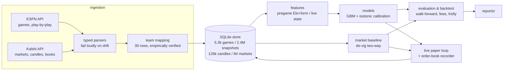
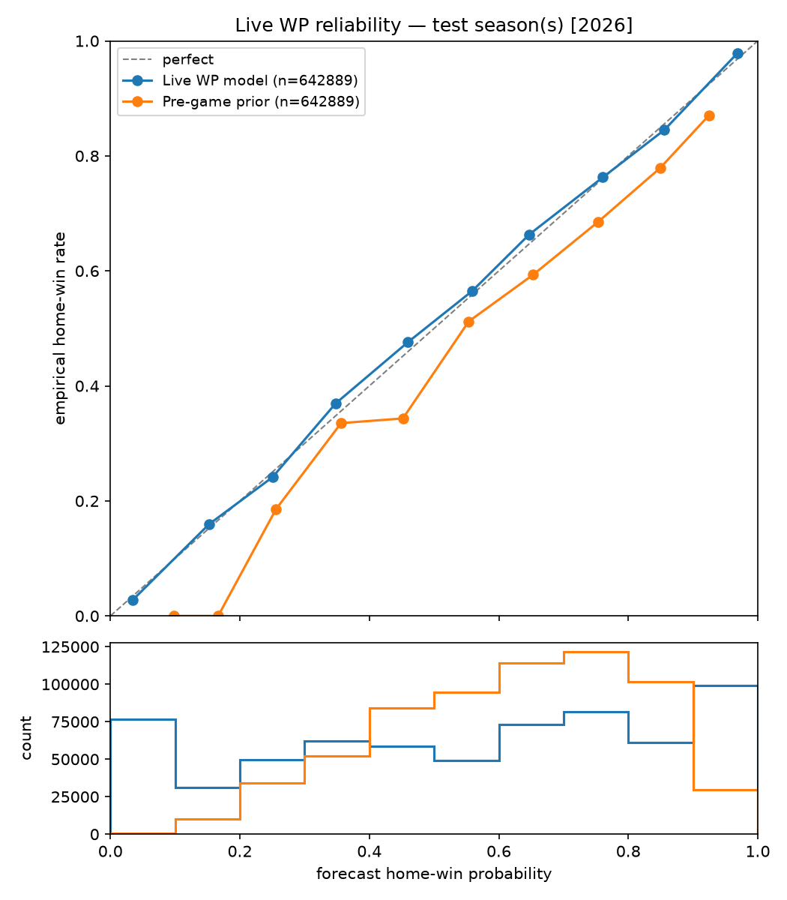
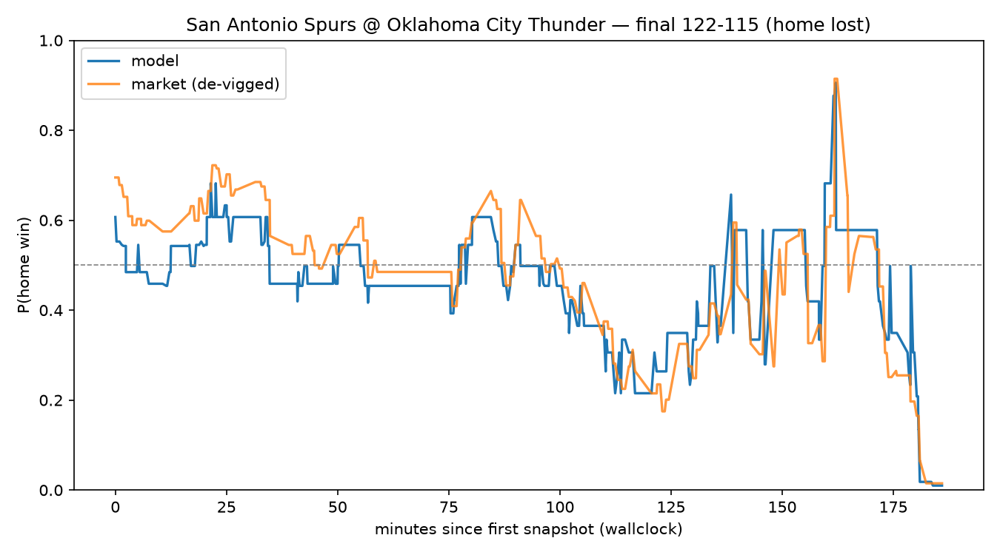

# nba-market-engine

[](https://github.com/zane180/nba-market-engine/actions/workflows/ci.yml)

Estimating NBA win probabilities — pre-game and live in-game — and measuring them
against the probabilities implied by [Kalshi](https://kalshi.com) prediction-market
prices: calibration analysis, a walk-forward backtest with the exchange's real fee
schedule, and a live paper-trading loop that doubles as a market-data recorder.

**The headline result is a calibration number, not a profit number.** The live
win-probability model reaches an expected calibration error of **0.011** across
642,889 held-out snapshots; against the market itself, no statistically
distinguishable edge survives — and this project treats saying so clearly as the
deliverable. Every number below is generated by `make repro` and lives in
[`reports/`](reports/).

---

## 1. Problem framing

The NBA game-winner market is liquid and roughly efficient: in the 2026 playoffs,
Kalshi's pre-game books carried a mean overround of just 0.002
([`reports/pregame_summary.md`](reports/pregame_summary.md)). Against such a market,
"my model is profitable" is an extraordinary claim requiring extraordinary evidence
— so the interesting, *defensible* questions are:

1. **How well-calibrated can an open-data model get?** (Brier score, log loss,
   ECE, reliability diagrams — never raw accuracy.)
2. **How close does it come to the market**, measured on identical games at
   identical information cutoffs, with the market's prices properly de-vigged?
3. **If any residual edge exists, does it survive fees, spreads, and honest
   uncertainty quantification** in a walk-forward backtest with no lookahead?

Framing the market as the measuring stick makes every result meaningful: a
calibrated model that *matches* an efficient market is evidence the pipeline is
sound; claiming to beat one on 42 games would be evidence of not understanding
variance.

## 2. Architecture



Data flow: ESPN is the spine (schedule, outcomes, play-by-play with wallclock
timestamps); Kalshi supplies markets, minute candles, and order books. Both APIs
are undocumented or retention-limited, so parsers are tested against committed
real payloads and raise on unrecognized shapes instead of guessing. The
ESPN↔Kalshi team mapping (they share no identifiers, and six abbreviations
disagree: `GS→GSW`, `NY→NYK`, `SA→SAS`, `NO→NOP`, `UTAH→UTA`, `WSH→WAS`) was
verified team-by-team against real Kalshi event tickers and fails loudly on
anything unmapped.

**A data-availability constraint shaped the design**: Kalshi's public API only
retains settled-market prices for roughly two months after close. At build time
that meant the 2026 playoffs — 84 markets across 42 games. ESPN history is deep
(model training uses four seasons), but every model-vs-market comparison below
rests on that 42-game overlap, and the numbers are presented accordingly. The
paper-trading loop records full order-book depth on every tick precisely to
outgrow this constraint over the 2026-27 season.

## 3. Methodology

**Pre-game.** A transparent Elo baseline (FiveThirtyEight construction: K=20 with
margin-of-victory multiplier, 100-point home advantage, 25% season-boundary
regression) feeds a gradient-boosted upgrade (features: Elo state, rest days,
back-to-backs, 10-game form, games played, playoff flag — no injury data; see
limitations). Features are built by a single chronological replay in which a
game's row is emitted *before* its result touches any state; an explicit
no-leakage test asserts a game's features are identical whether or not future
games exist in the input.

**Live.** P(home win | score diff, regulation seconds remaining, lead-per-√time,
pre-game prior, OT state), gradient-boosted over 2.4M historical play-by-play
snapshots. ESPN's per-play wallclock is the join key to market data — a snapshot
only ever sees market candles that closed at or before it.

**Calibration.** Isotonic regression fitted exclusively on out-of-fold training
predictions — grouped by game for the live model, because snapshots within a game
share an outcome and ordinary K-fold would leak labels between siblings. Every
probability is calibrated before it is compared to the market or used to trade.

**The market baseline.** A game has two mirror markets (one per team). Raw mid
prices are de-vigged multiplicatively (`p = raw_a / (raw_a + raw_b)`) into a clean
probability. Missing or one-sided books yield *no* baseline rather than a default.

**Evaluation discipline.** Walk-forward only: models predicting season S are
trained on strictly earlier seasons, calibrators frozen before the test season.
Comparisons use paired bootstrap CIs — resampled **by game**, since 19,350
market-joined snapshots are really n≈42 independent outcomes.

**Backtest.** Event-driven over the same walk-forward predictions: taker fills at
the standing top-of-book, Kalshi's real fee `ceil(0.07*C*P*(1-P))` (rounded up,
like the exchange), fractional Kelly (x0.25) on fee-adjusted prices with a 5%
bankroll cap and a 100-contract depth guard, one position per game (the mirror
markets would otherwise double exposure), held to settlement. Live entries execute
at the first candle >=60s *after* the model's information time, absorbing ESPN
broadcast lag. Baselines: never trade, and buy-the-favorite with flat stakes.

## 4. Results

All numbers regenerable via `make repro`; test season = 2025-26, trained on 2022-25.

**Calibration, full test season** ([`reports/pregame_summary.md`](reports/pregame_summary.md),
[`reports/live_summary.md`](reports/live_summary.md)):

| model | n | Brier ↓ | log loss ↓ | ECE ↓ |
|---|---|---|---|---|
| Pre-game Elo | 1,326 games | 0.2108 | 0.6120 | 0.0657 |
| Pre-game GBM (calibrated) | 1,326 games | 0.2120 | 0.6127 | **0.0306** |
| constant p=0.556 | 1,326 games | 0.2469 | 0.6869 | — |
| Live WP model (calibrated) | 642,889 snapshots | **0.1514** | 0.4531 | **0.0106** |
| pre-game prior only | 642,889 snapshots | 0.2119 | 0.6145 | 0.0655 |

Two honest observations: the GBM does **not** beat Elo on Brier — its value is
halving the calibration error — and the live model's reliability curve sits on
the diagonal across the entire probability range:



**Against the market** (42-game playoff overlap, identical information cutoffs):

| comparison | Brier (model) | Brier (market) | paired-bootstrap diff, 95% CI |
|---|---|---|---|
| pre-game GBM vs de-vigged market | 0.2260 | 0.2366 | −0.011 [−0.048, +0.024] — **not distinguishable** |
| live WP vs in-game market (19,350 snapshots) | 0.1855 | 0.1776 | +0.008 [−0.014, +0.029] — **not distinguishable** |

The model tracks the market closely through live games:



**Backtest** ([`reports/backtest_summary.md`](reports/backtest_summary.md); $1,000
bankroll, fees included):

| strategy | trades | fees | PnL | 95% CI on PnL (game bootstrap) |
|---|---|---|---|---|
| pre-game | 30 | $39.83 | +$245.60 | **[−$234, +$718]** |
| live | 42 | $45.60 | +$104.79 | **[−$337, +$586]** |
| buy-the-favorite baseline | 84 | $19.73 | −$97.66 | — |
| never trade | 0 | $0 | $0 | — |

The point estimates are positive; the intervals say one lucky playoff run.
The favorite-buying baseline shows what spread + fees cost a no-edge strategy
(~10% of bankroll over 84 bets). Conclusion as stated in the reports: **well
calibrated; no demonstrated edge over the market after fees.**

## 5. Edge thesis & limitations

Where could residual edge plausibly live? Thin, slow **live** books early in the
season; **regular-season pre-game** prices (the only observable window —
playoffs — is the market at its sharpest and deepest); and latency, which this
project deliberately handicaps itself on rather than claims. None of these is
demonstrated; the recorder exists to test them with real depth data next season.

Known limitations, in rough order of importance:

- **The market comparison rests on 42 playoff games** (Kalshi's API retention).
  Playoff markets are the hardest possible benchmark; regular-season books may
  differ in either direction.
- **Fills are modeled at top-of-book with no depth or impact** (candles carry no
  book depth) — optimistic for size, mitigated by the 100-contract guard.
- **No injury/lineup features**; point-in-time injury data wasn't cleanly
  available, and reconstructing it retroactively risks lookahead.
- **ESPN wallclock lag** means the market may know the score seconds before the
  model does; the 60s execution delay absorbs but doesn't eliminate this.
- No exit modeling (positions hold to settlement); Postgres wiring exists but
  only SQLite is exercised; ~2% of historical games lack play-by-play.

## 6. What's next

- **Run the recorder through 2026-27** (a launchd agent ships in `deploy/`):
  order-book depth + the paper-trade ledger accumulate from opening night,
  enabling depth-aware fill simulation and a regular-season market comparison at
  real scale.
- Maker-side strategies: quoting instead of crossing, earning the spread the
  backtest currently pays.
- Injury/lineup features from a point-in-time source.
- Live-model upgrades: possession state, team-strength interactions, and a
  latency-measured (not assumed) execution model.

## Quick start

```bash
make setup                    # uv sync (Python 3.12, pinned deps)
make check                    # ruff + mypy --strict + pytest (251 tests) — same as CI
uv run engine ingest all      # backfill games/markets/candles/snapshots
make repro                    # regenerate every report cited above
uv run engine paper --once    # one live paper-trading tick
make install-paper-daemon     # background recorder (macOS launchd)
```

Configuration is environment-only (`.env.example`). Paper trading is the default
and only enabled execution path; real-money order placement requires four
independent gates (env flag, `--live`, credentials, typed confirmation) and
dry-runs otherwise. Notebooks in [`notebooks/`](notebooks/) walk the dataset,
calibration, and backtest interactively.

## License

MIT
