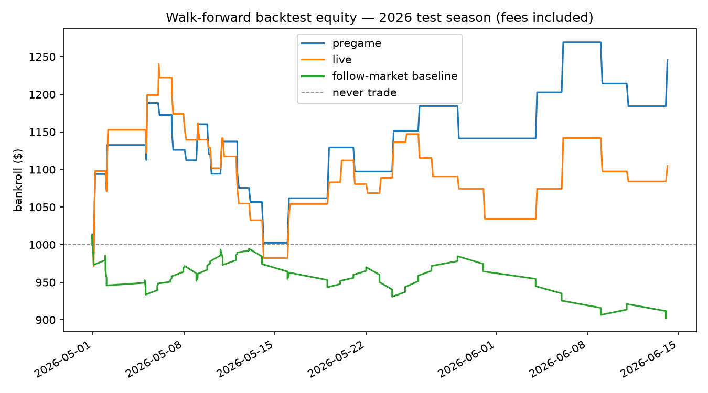

# Walk-forward backtest

Universe: **84 settled Kalshi markets** (2026 playoffs — all the API retains; see data-retention note). Initial bankroll $1,000; taker fills at the standing top-of-book; Kalshi fee formula `ceil(0.07*C*P*(1-P))`; fractional Kelly (x0.25, 5% cap, 100-contract depth guard); **one position per game** (a game's two markets are mirror images — trading both would silently double exposure), held to settlement; live entries delayed 60s after the model's information time.

| strategy | trades | turnover $ | fees $ | PnL $ | ROI | max DD | sharpe-like |
|---|---|---|---|---|---|---|---|
| pregame (after fees) | 30 | 966.37 | 39.83 | +245.60 | +24.56% | 15.65% | +0.62 |
| pregame (zero-fee diagnostic) | 37 | 1088.36 | 0.00 | +270.82 | +27.08% | 14.86% | +0.63 |
| live (after fees) | 42 | 1176.43 | 45.60 | +104.79 | +10.48% | 20.81% | +0.30 |
| follow-market baseline | 84 | 827.79 | 19.73 | -97.66 | -9.77% | 11.01% | -1.42 |
| never trade | 0 | 0.00 | 0.00 | +0.00 | +0.00% | 0.00% | - |

### Is the PnL distinguishable from luck? (game-level bootstrap, 95% CI)

- pregame total PnL CI: [-234.00, +718.42] $
- live total PnL CI: [-336.88, +586.03] $

**Read this with the calibration reports, not instead of them.** With this few independent games, ROI is dominated by variance; the paired-bootstrap probability comparisons in `pregame_summary.md` / `live_summary.md` are the honest estimate of edge. A PnL interval that excludes zero on 42 games is still one lucky playoff run, not a validated strategy. The sharpe-like column is a per-trade mean/std*sqrt(n) analogue, not an annualized Sharpe. Fills assume top-of-book depth up to 100 contracts with no market impact — optimistic for real size.

