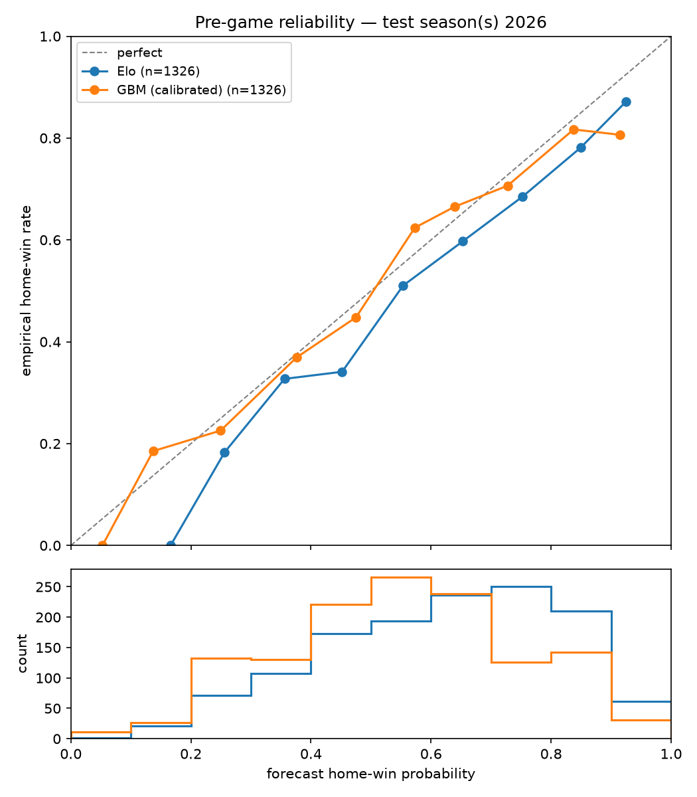

# Pre-game model evaluation

Walk-forward test season(s): **2026** (trained on strictly earlier seasons; no in-season refits).

## Full test set (all final games)

| model | n | Brier | log loss | ECE |
|---|---|---|---|---|
| Elo | 1326 | 0.2108 | 0.6120 | 0.0657 |
| GBM (isotonic-calibrated) | 1326 | 0.2120 | 0.6127 | 0.0306 |
| constant p=0.556 | 1326 | 0.2469 | 0.6869 | 0.0000 |

## Market-covered subset

Games with a usable de-vigged Kalshi quote at tipoff: **42** (mean overround 0.002). Kalshi's API only retains recent market history, so this subset is small and currently playoffs-only — read the intervals, not the point estimates.

| model | n | Brier | log loss | ECE |
|---|---|---|---|---|
| Market (de-vigged mid) | 42 | 0.2366 | 0.6614 | 0.1698 |
| GBM (isotonic-calibrated) | 42 | 0.2260 | 0.6440 | 0.0848 |
| Elo | 42 | 0.2257 | 0.6415 | 0.2076 |

### Paired bootstrap, Brier difference vs. market (negative = beats market)

- GBM - market: -0.0106 (95% CI [-0.0475, +0.0244]) — not distinguishable
- Elo - market: -0.0109 (95% CI [-0.0432, +0.0201]) — not distinguishable

